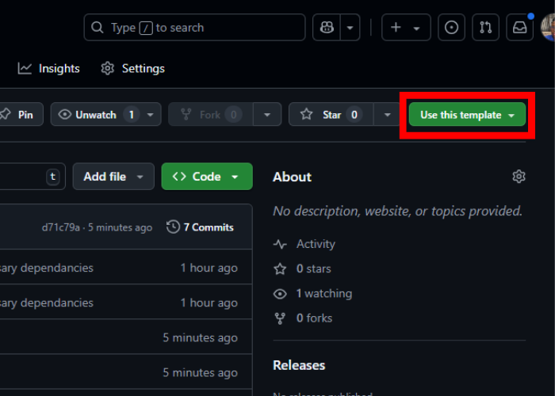

# Webpack Starter Template

A modern webpack boilerplate for building front-end projects with hot-reloading, optimized builds, and simple deployment to GitHub Pages.

## Features

- Webpack 5 bundling
- Development server with hot reload
- Separate dev and production configs
- ESlint + Prettier setup
- GitHub Pages deployment
- Modular file structure

## Getting Started

1. Click on 'use this template'
   

2. Create your repo and clone it locally.
3. Install the required dependencies:

```bash
npm install
```

## NPM Scripts

There are a few prewrittern scripts to preview, build, and deploy the project

- `dev` - Starts the development environment with live-reloading. By default, this is hosted on https://localhost:8080
- `build` - Builds the project and pushes file to the dist/ folder
- `deploy` - builds the project and pushes the dist/ folder to the gh-pages branch.
- `lint` - Runs ESLint on the 'src/' directory to check for issues.

> When running the 'deploy' script, make sure your repo is already initialized with git, committed, and linked to GitHub.

## Project Structure

```bash
webpack-starter-template/
├── dist/                # Production build output
├── src/                 # Source code
├── webpack.dev.js       # Webpack development config
├── webpack.prod.js      # Webpack production config
├── package.json
└── README.md
```
